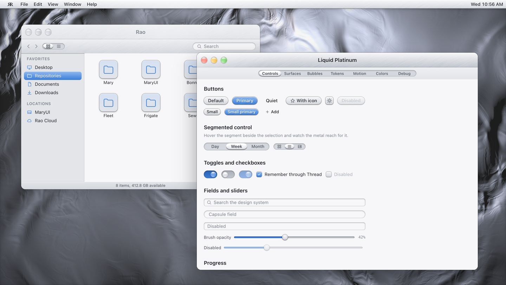
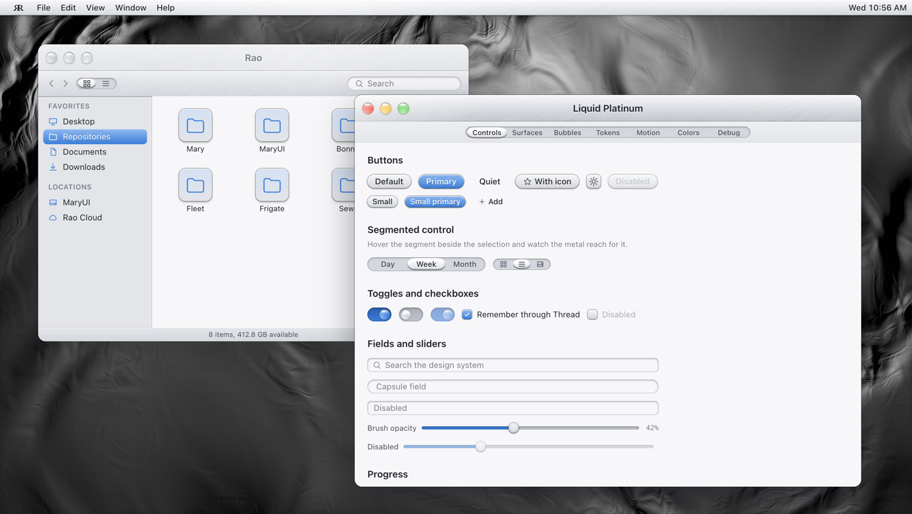
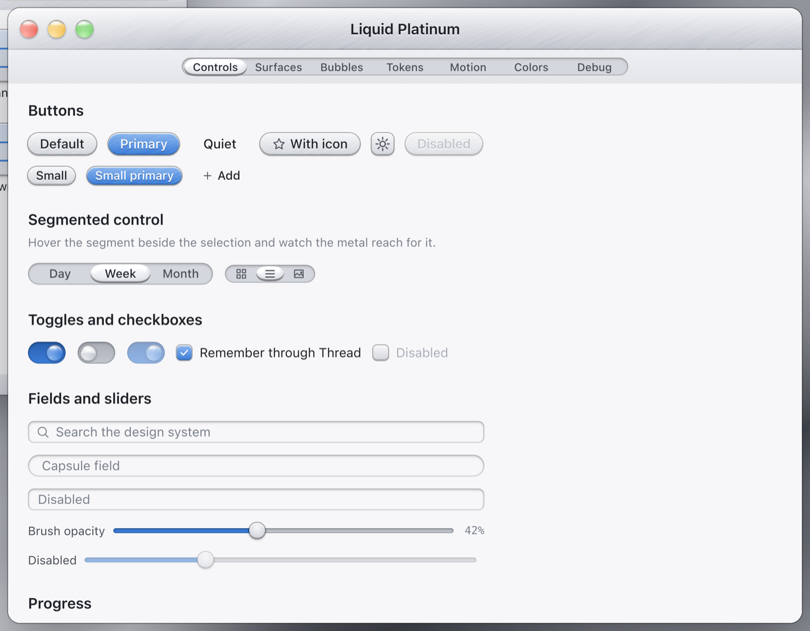
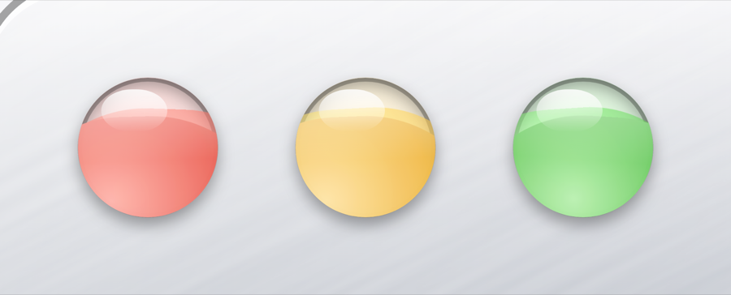
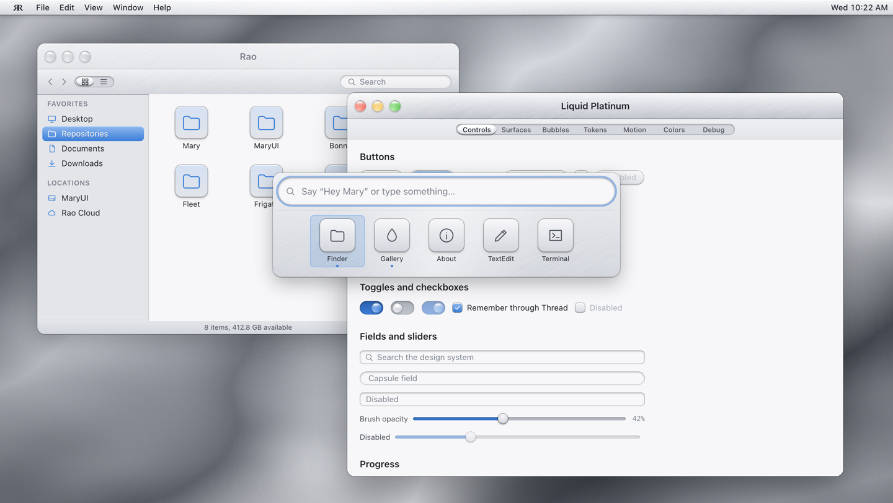
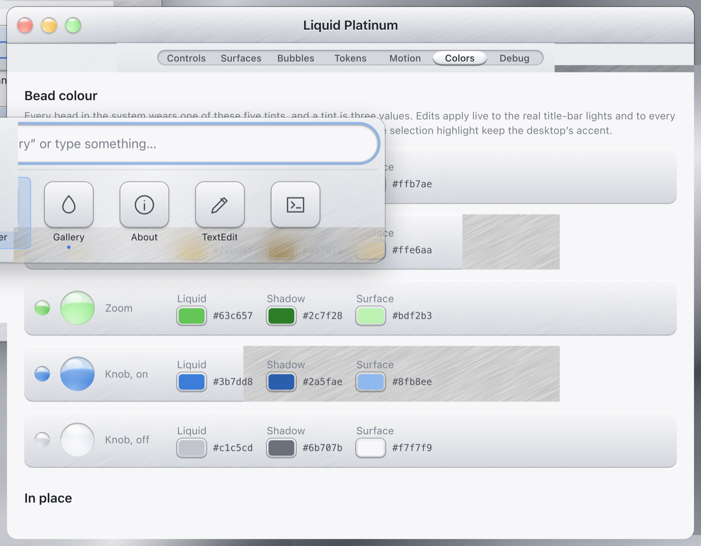

# MaryUI

Rao's desktop-first design system, theme **Liquid Platinum**: brushed platinum that behaves like
liquid. The specular sheen slides across a window as you drag it, the hairline scratches lag behind
the frame and spring back, all four corners flex independently between 8 and 16px, the traffic
lights are glass beads whose water sloshes with the window, and adjacent controls merge like drops of
mercury. The desk itself is a sheet of molten platinum that flows only while you are moving something
on it. No refraction on the chrome — that metal is solid; only the light and the liquid move.



## What is here

| | | |
| --- | --- | --- |
| **[`web/`](web/)** | The design system and its reference implementation — a simulated desktop in React. **Start here.** | [docs](web/README.md) |
| **[`linux/`](linux/)** | The same system in C: `libmaryui` plus `maryui-desktop`, a wlroots compositor that *is* the desktop. | [docs](linux/README.md) · [parity](linux/PARITY.md) |
| **[`web/tokens/tokens.json`](web/tokens/tokens.json)** | The contract both implementations are built from. Edit this, not the generated files. | |
| **[`web/design/`](web/design/)** | `liquid-platinum.sketch`, generated from the tokens and the component anatomy. | [docs](web/design/README.md) |
| **[`docs/design-direction.md`](docs/design-direction.md)** | What the molten shader teaches, and what the rest of the system is measured against. | |

```sh
cd web && npm install && npm run dev     # http://127.0.0.1:8140
cd linux && make check-deps && make      # then build/maryui-desktop
```

## How the two halves relate

`tokens.json` is the single source of truth. `npm run tokens` in `web/` emits the CSS custom
properties and typed constants the web app uses, a Sketch palette, **and** `linux/include/maryui/
lp_tokens.h` — so both implementations read the same numbers rather than agreeing by hand. The
physics is small enough to port directly: `lp_spring.c`, `lp_slosh.c`, `lp_velocity.c` and
`lp_motion.c` are line-for-line ports of `web/src/lib`, and their tests carry the same case names as
the vitest suites so `make test` can be read next to `npm test`. `linux/PARITY.md` tracks every web
file, its C counterpart, and every deliberate deviation.

The C desktop carries the same visual pass as the web: the 42px title bar, the liquid corners, the
moving grain, the glass-bead traffic lights, the lit merge filter and the molten wallpaper. The one
place they part company is where the shader's clock runs — see **D12** in `linux/PARITY.md`.

## The direction

The wallpaper is a domain-warped height field lit by two lights — molten platinum, and the reference
the rest of the system is measured against. Nothing in it is painted: the ridges, the sheen along a
fold and the shadow one ridge casts on the next all fall out of lighting one scalar field.
[The direction is written down](docs/design-direction.md).


Its clock is not wall-clock time — it is *window motion*. The wallpaper registers with the motion
engine as a target that draws when stepped but never asks for a frame of its own, so the metal flows
while you drag a window and freezes the moment everything settles. An idle desktop still schedules
zero animation frames, which is the rule the whole system is built on.

Two grades ship (View › Molten · Platinum / Faithful): one lifted into the palette's cool cast, one
keeping the shader's own dark original.



## The system, in a few pictures

Every control in every state, with the tokens and the physics that drive them:



The traffic lights are the same glass bead the Toggle uses for its knob — a well of coloured liquid
with a waterline that tilts and banks as the window moves:



Spotlight is also the dock: a blank query shows every app as a tile, typing filters apps, commands
and open windows.



The Gallery is the tuning surface, not just a catalogue. **Motion** retunes the springs, the slosh
and the merge live; **Colors** recolours every bead's tint; both hand back a JSON patch to paste into
`tokens.json`. **Debug** turns on the crest hairline, reveals the raw merge layer and freezes the
ambient wave.



## Taking it elsewhere

`tokens.json` is DTCG-shaped and the emitters live in
[`web/scripts/tokens-lib.mjs`](web/scripts/tokens-lib.mjs) — the C one is about 100 lines and is the
model for adding another. The physics in `web/src/lib/spring.ts`, `slosh.ts` and `radius.ts` are a
dozen lines each and port directly. See [Taking it elsewhere](web/README.md#taking-it-elsewhere).

GPL-3.0-or-later. See [`web/LICENSE`](web/LICENSE).
