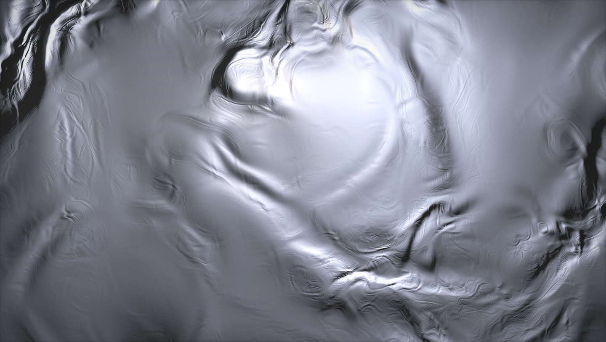

# Design direction — molten platinum

The desktop wallpaper is a shader ([the original](https://www.shadertoy.com/), by Mårten Rånge;
ported in [`web/src/lib/moltenShader.ts`](../web/src/lib/moltenShader.ts)). It is not decoration.
It is the reference the rest of the system is measured against, and this page is what it teaches.

## What the shader does

Nothing in that image is painted. There is a single scalar height field, and everything you see —
ridges, creases, the sheen along a fold, the shadow one ridge casts on the next — falls out of
lighting that field. Six ideas are worth stealing whole.

**1. Detail comes from folding, not from stacking.** The field is domain-warped: noise is evaluated,
its result is used to displace the coordinates of the next evaluation, twice over. Adding octaves
makes noise *busier*; warping makes it *structured*. The creases that read as hammered metal are
folds in the coordinate space, and no amount of extra octaves would produce them.

**2. The base noise folds rather than blurs.** `onoise` is two sines crossfaded by a function of
their own product. Ordinary value noise interpolates smoothly between random points and reads as
cloud; this one creases. The material's identity is in that choice.

**3. Light the field; do not paint it.** Colour is `baseCol` multiplied by lighting terms, so the
entire image regrades from one uniform. That is why the same field can be the platinum tone and the
faithful tone without touching the geometry — and why a surface built this way can be re-themed
without being redrawn.

**4. Two lights, one dominant.** A broad key gives the body (`pow(diff1, 1.5)` plus a wide
`pow(diff1, 0.5)` wash); a second, opposing light contributes almost nothing except a tight rim
(`pow(diff2, 7.0)`). Bodies come from soft light, edges from hard light. The emboss vocabulary
already in the system is the same idea at 1px.

**5. Shadows by resampling, not by marching.** The shadow term samples the height field *again*, one
step toward the light, and takes the difference. One extra evaluation buys contact shadow. Cheap
approximations of the right phenomenon beat exact solutions to the wrong one.

**6. Grade once, at the end.** Contrast, then saturation, then vignette — applied to the finished
image, not to each layer. Every layer stays linear and honest; the mood is one function at the end.

## What that means here

- **Surfaces should be lit, not drawn.** A gradient that imitates lighting will disagree with the
  real lighting next to it. The merge filter already went this way — the blobs carry no emboss and
  the filter lights the merged silhouette — and it is why merged metal stopped looking like putty.
- **Reach for warping before detail.** When a surface reads as flat, the first question is whether
  its coordinates can be disturbed, not whether it needs another layer.
- **Motion reorganises the material; it does not slide it.** The shader animates by *rotating the
  warp vectors*, so the metal reorganises in place. Nothing translates.
- **One grade, applied last.** Tone belongs at the end of the pipeline, as a handful of tokens.
- **Anything that moves is tied to a gesture.** See below — this is the hard constraint, and the
  wallpaper is where it became an idea rather than a restriction.

## The rule the wallpaper had to obey

An idle desktop schedules **zero animation frames**. It is documented in
[`web/README.md`](../web/README.md), verified in the browser, and mirrored in the C compositor. A
shader with a wall-clock uniform runs forever and breaks it.

So the shader's clock is not wall-clock time — it is *window motion*. The wallpaper registers with
the motion engine as a target that draws when stepped but never asks for a frame of its own
(`step()` returns `false`). While a window is being dragged the engine is already running, so the
metal flows; the moment everything settles the loop stops and the metal freezes exactly where it is.

The constraint made the idea better than the unconstrained version would have been. The desk is one
sheet of liquid metal, and it moves only when you move something on it.

## Honest tensions

Recorded rather than glossed, because a direction is only useful if you can tell what does not yet
follow it:

- **The brushed grain translates.** `Surface`'s hairlines slide behind a moving frame — a texture
  moving across a surface, which is exactly what point 3 above argues against. It reads well and it
  is cheap; a warped grain that reorganises would be truer, and much more expensive.
- **The wallpaper is lit; the chrome is painted.** Window surfaces are still vertical gradients with
  a separate sheen layer, not a lit field. Closing that gap is the largest and most interesting piece
  of work this direction implies, and nothing forces it to happen at once.
- **The tones disagree about legibility.** The `platinum` grade belongs to the palette; the
  `faithful` grade separates windows from the background better. Both ship (View › Molten ·
  Platinum / Faithful) precisely because the trade is real.

## The knobs

All of it is tokens, under `molten` in
[`web/tokens/tokens.json`](../web/tokens/tokens.json): `flow` (shader time per second of window
motion), `zoom`, a grade per tone (`base`, `lift`, `gain`, `saturation`), and the resolution pair.

Resolution follows what the desktop is doing. `scale` is the fraction of *device* pixels drawn while
something is moving — below 1, to leave the GPU to the interface during a drag. `scale-still` is what
gets drawn `settle-ms` after the last motion frame, and it is 1: native. The wallpaper you actually
sit and look at is never upscaled. `max-pixels` caps the buffer so a 4K display at dpr 2 is not asked
for a 33-megapixel frame.

That split is worth stating as a rule of its own: **spend quality on the still, spend speed on the
motion.** A frame that is on screen for one sixtieth of a second, while the thing you are looking at
is a window under your cursor, does not need the resolution that the image you then stare at does.
